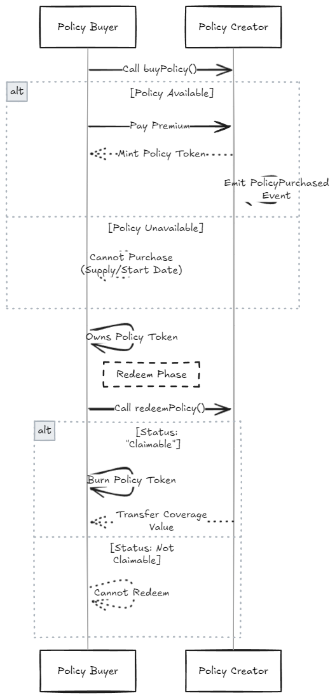
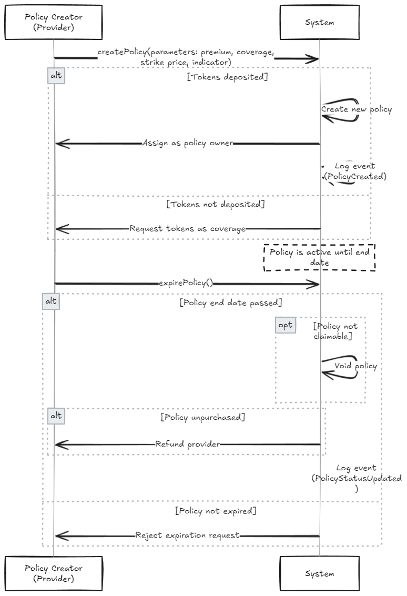
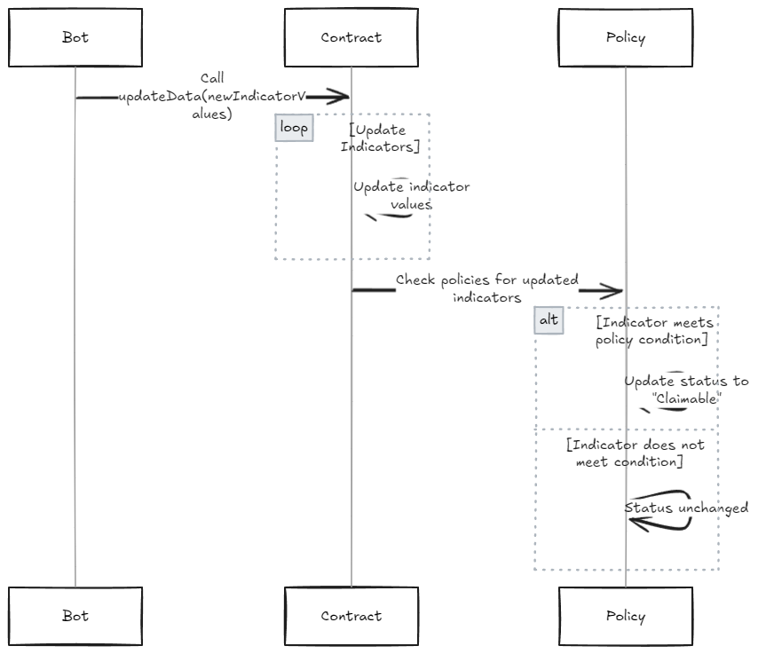

# MacroGuard

A dApp built with [Flare FDC](https://dev.flare.network/fdc/overview/) to create and purchase policies based on economic indicators. Data is sourced from the St. Louis Fed Web Services: FRED® API.

## End-to-End Flow

The full flow is divided into three parts:

-   Create and Expire Policy
-   Buy and Redeem Policy
-   Update Data

There are three main entities involved:

- **Policy Buyer** (User)
- **Policy Creator** (Provider)
- **Bot**

### Create and Expire Policy

The policy creator deposits coverage tokens to create policies. Later, they can expire the policies to reclaim funds from unpurchased or expired policies.



### Buy and Redeem Policy

The policy buyer pays a premium to purchase a policy token and can redeem it for coverage if the policy becomes claimable.



### Update Data

A bot periodically updates external indicator values, which may trigger changes in policy statuses based on strike conditions.



## Quick Start

Clone the repo:

```bash
git clone git@github.com:nikbhintade/MacroGuard.git
cd MacroGuard
```

### Frontend

Navigate to the `/frontend` directory and install dependencies:

```bash
yarn
```

To start the app locally, run:

```bash
yarn dev
```

### Contract

Navigate to the `/contract` directory and install dependencies:

```bash
yarn
```

Compile the contracts:

```bash
yarn hardhat compile
```

Run the tests:

```bash
yarn hardhat test
```

## What's Next?

- [ ] Fix and stabilize tests  
- [ ] Write a blog post about building with FDC  
- [ ] Update the code to accept any token while keeping pricing in USD using FTSO integration  
